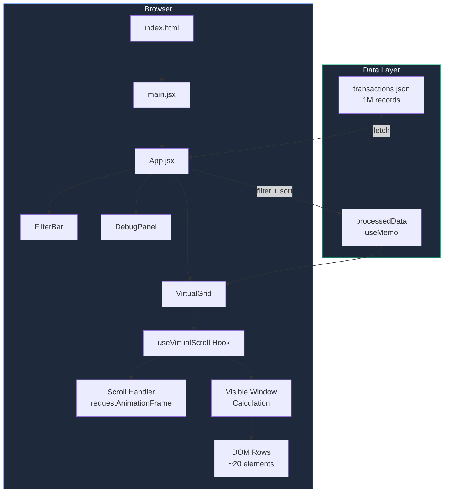
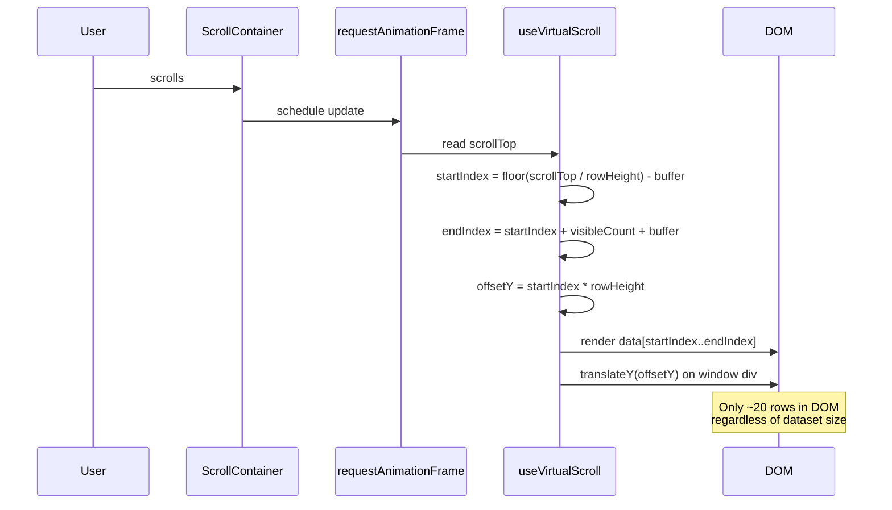
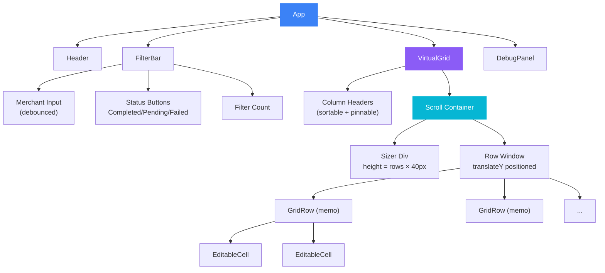
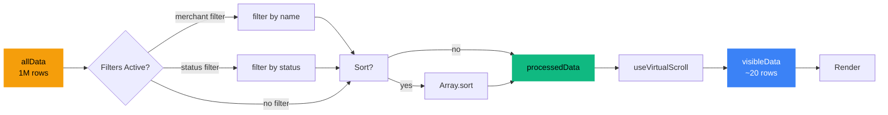

# Architecture

How the financial data grid works under the hood.

## System Overview



## Virtual Scrolling Flow

The core virtualization runs in three steps every time the user scrolls:



## Component Tree



## DOM Structure

```
grid-scroll-container          ← overflow-y: scroll
  ├── grid-sizer               ← height: totalRows × 40px (creates scrollbar)
  └── grid-row-window           ← position: absolute, translateY(offsetY)
       ├── virtual-row-0        ← only visible rows rendered
       ├── virtual-row-1
       ├── ...
       └── virtual-row-N        ← N ≈ 20 (viewport + buffer)
```

## State Management



## Key Design Decisions

| Decision | Why |
|----------|-----|
| Fixed row height (40px) | Enables O(1) scroll position calculation |
| `translateY()` over `top` | GPU-accelerated, avoids layout thrashing |
| `requestAnimationFrame` throttling | Aligns updates with browser paint cycle |
| `React.memo` on rows | Prevents re-render of unchanged rows |
| `useMemo` for filtered data | Avoids re-filtering on unrelated state changes |
| Streaming JSON fetch | Shows progress while loading 200MB+ file |
