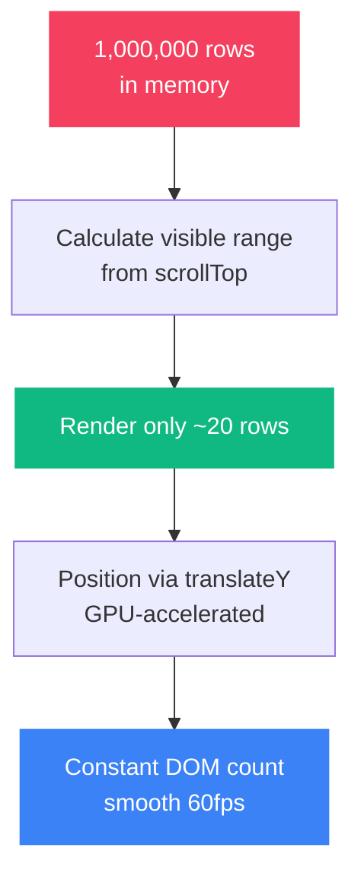

# Performance Notes

How the grid maintains smooth performance with 1 million rows.

## The Problem

Rendering 1M DOM elements crashes the browser. Even 100K nodes cause severe lag. The solution is to never render more than what fits on screen.

## What We Do

### Virtual Scrolling



### Scroll Throttling

The `onScroll` handler uses `requestAnimationFrame` to batch updates. This means we update at most once per frame (~16ms), preventing layout thrashing.

```
scroll event → cancel prev rAF → schedule new rAF → update on next paint
```

### Memoization

- `React.memo` on `GridRow` — rows don't re-render unless their data changes
- `useMemo` on `processedData` — filtering and sorting only recompute when inputs change, not on every render

### Filter Debouncing

The merchant filter input is debounced at 250ms. Typing fast doesn't trigger a re-filter on every keystroke — we wait until the user pauses.

## Performance Targets

| Metric | Target | How We Achieve It |
|--------|--------|-------------------|
| DOM node count | < 100 at all times | Virtual scrolling with buffer |
| Scroll FPS | > 55fps | rAF throttling + translateY |
| Filter response | < 500ms | Direct Array.filter on 1M items |
| Sort response | < 1s | Array.sort with comparator |
| Memory | < 800MB | Data in plain arrays, no duplication |

## What Could Be Added

- **Web Workers** — move sort/filter off main thread
- **DOM recycling** — reuse nodes instead of unmount/remount
- **Binary search** — for jump-to-row on large sorted datasets
- **Column virtualization** — for grids with 50+ columns
