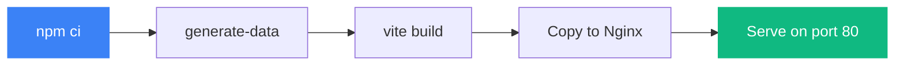

# Setup Guide

How to get the project running locally or with Docker.

## Prerequisites

- Node.js 18+ (20 recommended)
- npm 9+
- Docker & Docker Compose (for containerized run)

## Local Development

```bash
# 1. Install dependencies
npm install

# 2. Generate the 1M row dataset
npm run generate-data
# Creates public/transactions.json (~200MB)

# 3. Start dev server
npm run dev
# Open http://localhost:5173
```

## Docker Deployment

```bash
# Build and run (handles data generation inside the container)
docker-compose up --build

# Access at http://localhost:8080
```

The Docker build is multi-stage:
1. **Build stage** — installs deps, generates data, builds the Vite app
2. **Serve stage** — copies static files into Nginx



## Environment Variables

See `.env.example` for available variables. Currently used by Vite:

| Variable | Default | Purpose |
|----------|---------|---------|
| `VITE_APP_TITLE` | Financial Data Grid | Page title |
| `VITE_ROW_HEIGHT` | 40 | Row height in pixels |
| `VITE_BUFFER_ROWS` | 10 | Extra rows above/below viewport |

## Useful Commands

| Command | What it does |
|---------|-------------|
| `npm run dev` | Start Vite dev server |
| `npm run build` | Production build to `dist/` |
| `npm run preview` | Preview production build |
| `npm run generate-data` | Generate 1M transaction records |
| `npm run lint` | Run ESLint |
| `docker-compose up` | Build + run in Docker |
| `docker-compose down` | Stop containers |
